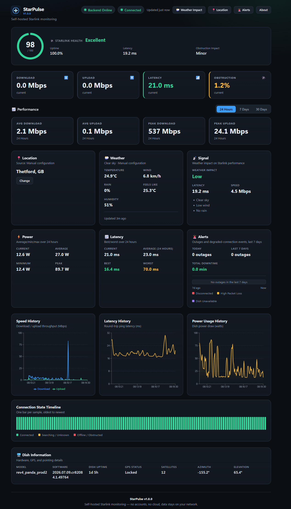

# StarPulse

StarPulse is a **self-hosted, local-first dashboard for Starlink telemetry**.
Install it on your own PC, a Raspberry Pi, or a home server, and view your
Starlink dish's status from a web browser on your local network — no cloud
account, no external service, no telemetry leaving your network.

It's built in the spirit of tools like **Home Assistant** and **Grafana**:
a small local web server backed by SQLite, configured with a plain text
file (or a first-run setup page), and designed to be extended with
plugins/modules over time.

> **Status:** backend + Starlink collector + read API + web dashboard +
> power/latency/weather/outage insights + installable PWA + first-run
> setup + Docker packaging. See [Roadmap](#roadmap) for what's still
> missing (auth, retention policies, write/control endpoints).

## Screenshots

> _Add screenshots here once you have a dish to point StarPulse at —
> `docs/screenshots/dashboard.png` and `docs/screenshots/setup.png` are
> good default paths to drop them in._

| Setup wizard | Dashboard |
| --- | --- |
|  |  |

## Design principles

- **Local-first.** Everything runs on your machine. No cloud dependency,
  ever, for core functionality.
- **No accounts.** There is no login system in this phase — it's assumed
  to run on a trusted local network.
- **SQLite.** A single-file database, easy to back up, easy to inspect,
  zero setup.
- **Modular.** The backend is organized into independent layers
  (config, logging, database, collector, API) so features can be added
  without rewriting the foundation. In particular, the Starlink collector
  has no dependency on FastAPI or the API layer — it's a plain background
  service that happens to be started/stopped by the web app's lifespan.
- **Boring, explicit dependencies.** Only what's needed: FastAPI for the
  API, SQLAlchemy for the database, Pydantic for validated settings,
  `tomli-w` to persist setup-wizard changes back to `config.toml`,
  `httpx` for the (optional, key-free) Open-Meteo weather lookup, and
  `starlink-grpc-core` (the packaged core of
  [sparky8512/starlink-grpc-tools](https://github.com/sparky8512/starlink-grpc-tools))
  for talking to the dish.

## Project layout

```
StarPulse/
├── src/starpulse/
│   ├── app.py                 # FastAPI application factory (wires up the collector)
│   ├── __main__.py            # `python -m starpulse` entry point
│   ├── logging_config.py      # Logging setup (console + rotating file)
│   ├── core/
│   │   ├── paths.py           # Data dir / config file / db path resolution
│   │   └── setup_state.py     # First-run "has setup completed?" flag (in app_meta)
│   ├── config/
│   │   ├── defaults.py        # Built-in default configuration
│   │   ├── settings.py        # TOML + env var settings loader (read)
│   │   └── writer.py          # Persists setup-wizard changes back to config.toml (write)
│   ├── db/
│   │   ├── base.py            # SQLAlchemy engine/session/Base
│   │   ├── models.py          # ORM models (AppMeta, TelemetrySample)
│   │   └── session.py         # Database class (init + session lifecycle)
│   ├── collector/              # Starlink telemetry collection (no FastAPI dependency)
│   │   ├── client.py           # StarlinkClient protocol + gRPC implementation
│   │   ├── repository.py       # Persistence/query helpers for TelemetrySample + ConnectionEvent
│   │   ├── outages.py          # Degraded-connection classification (disconnected/high loss/dish down)
│   │   └── poller.py           # Background thread that polls on an interval
│   ├── services/
│   │   ├── weather.py          # Open-Meteo client + TTL cache
│   │   ├── weather_repository.py # Persist/query weather_samples
│   │   ├── weather_sampler.py  # Background weather history sampler
│   │   ├── weather_impact.py   # Weather Impact severity + reasons
│   │   └── location.py         # Weather location priority resolver
│   └── api/
│       ├── router.py          # Aggregates feature routers under /api
│       ├── deps.py            # Shared FastAPI dependencies
│       ├── schemas.py         # Pydantic response models
│       └── routes/
│           ├── health.py      # GET /api/health
│           ├── setup.py       # GET/POST /api/setup (first-run wizard)
│           ├── starlink.py    # GET /api/starlink/{status,history,summary,health,dish-info,outages}
│           └── weather.py     # GET /api/weather, /impact, /history
├── tests/                     # pytest suite mirroring the package layout
│   ├── collector/              # Collector tests, using mocked dish responses
│   └── services/                # Weather client/cache + impact tests
├── frontend/                  # React + TypeScript dashboard (separate app, see below)
│   ├── public/
│   │   ├── icons/               # PWA app icons (192/512/maskable)
│   │   └── favicon.ico
│   ├── src/
│   │   ├── api/                # Fetch client, types mirroring the Pydantic schemas, mock data
│   │   ├── hooks/               # useStarlinkTelemetry (polling + mock fallback), usePwaInstallPrompt
│   │   ├── components/          # Dashboard, WeatherImpactPage, SetupWizard, cards/charts
│   │   └── utils/format.ts     # Number/duration/time formatting helpers
│   ├── vite.config.ts          # Dev server + /api proxy + vite-plugin-pwa (manifest/service worker)
│   ├── Dockerfile              # Multi-stage build -> nginx (serves the SPA, proxies /api)
│   ├── nginx.conf
│   └── package.json
├── Dockerfile                  # Backend image (FastAPI + collector)
├── docker-compose.yml          # Runs backend + frontend together, with a persistent volume
├── pyproject.toml
├── .env.example
└── README.md
```

## Requirements

Pick one of the two installation methods below and you only need its
requirements:

- **Docker:** Docker Engine 24+ and the Docker Compose plugin (`docker
  compose version`). Nothing else — Python and Node both run inside the
  containers.
- **Local/development:** Python 3.11+ (uses the standard library
  `tomllib`) for the backend, and Node.js 20+ / npm for the frontend.

Either way, you'll want your machine on the same local network as the
Starlink dish (reachable at `192.168.100.1` by default) for real
telemetry — StarPulse runs fine without that too, just showing mock data
on the dashboard until it can reach a dish.

## Installation

### Option A: Docker Compose (recommended)

This builds and runs the backend and frontend as two containers, with
one persistent volume for the database/config/logs.

```bash
git clone https://github.com/<you>/StarPulse.git
cd StarPulse
cp .env.example .env   # optional — only needed to change default ports

docker compose up -d --build
```

Then open **http://localhost:8080** (or `STARPULSE_WEB_PORT` if you
changed it) — you'll land on the first-run setup page. The raw API and
`/docs` stay reachable directly at **http://localhost:8000**.

```bash
docker compose ps               # see status + healthcheck state
docker compose logs -f backend  # tail backend logs (collector, requests)
docker compose down             # stop (keeps the starpulse-data volume)
docker compose down -v          # stop AND delete all persisted data
```

See [Docker details](#docker-details) below for volumes, healthchecks,
and updating.

### Option B: Local development (no Docker)

Backend:

```bash
python -m venv .venv
source .venv/bin/activate        # Windows: .venv\Scripts\activate

pip install -e ".[dev]"
python -m starpulse               # http://localhost:8000
```

Frontend (in a second terminal):

```bash
cd frontend
npm install
npm run dev                       # http://localhost:5173, proxies /api to :8000
```

Open the frontend URL — that's the dashboard. The backend alone (without
the frontend running) is still fully usable via `curl`/`/docs` if you
just want the API.

## First-run setup

The first time StarPulse runs (no `setup_completed` flag in its
database yet), the frontend shows a setup page instead of the dashboard,
asking for:

- **Starlink dish IP address** (default `192.168.100.1`, correct for
  almost all installations)
- **Polling interval**, in seconds
- **Application port** StarPulse's backend should listen on
- **Optional weather latitude / longitude** — leave blank to use dish
  GPS when available; if both are provided they are written to
  `[weather]` in `config.toml`

Submitting the form:

1. Persists the values to `config.toml` (via `starpulse.config.writer`).
2. Immediately reconfigures the running collector with the new dish
   host/polling interval — no restart needed for those two.
3. Marks setup as complete, so future visits go straight to the
   dashboard.

Changing the **port** is the one exception: since the web server is
already bound to its current port, that change only takes effect after
you restart the process (`docker compose restart backend`, or re-run
`python -m starpulse`). The wizard tells you when a restart is needed
and lets you continue to the dashboard on the current port in the
meantime.

You can revisit these settings anytime by calling `POST /api/setup`
again (there's no dedicated "settings" page in the UI yet — see
[Roadmap](#roadmap)), or by editing `config.toml` directly and
restarting.

## Starlink telemetry collection

The collector (`starpulse.collector`) is a small, self-contained
background service:

- `GrpcStarlinkClient` talks to the dish using the `starlink_grpc` module
  from `starlink-grpc-core`, which resolves the dish's gRPC protocol via
  reflection at runtime — no protobuf files to generate or vendor.
- `StarlinkPoller` runs on its own daemon thread, calling the client on a
  fixed interval and writing results through `starpulse.collector.repository`.
  It has no import dependency on FastAPI; `app.py` just starts/stops it
  during the ASGI lifespan, and the setup wizard can hot-swap its
  client/interval via `StarlinkPoller.reconfigure()`.
- Both are built against a small `StarlinkClient` protocol, so tests (and
  any future alternate transport) can swap in a fake client without
  touching gRPC at all — see `tests/collector/`.

Each poll stores one row in the `telemetry_samples` table:

| Column                | Meaning                                             |
| ---------------------- | ---------------------------------------------------- |
| `timestamp`            | When the sample was collected (UTC)                  |
| `connection_state`     | Dish-reported state, e.g. `CONNECTED`, `SEARCHING`   |
| `uptime_seconds`       | Seconds since the dish last rebooted                 |
| `download_bps` / `upload_bps` | Throughput, in bits per second                |
| `latency_ms`           | Round-trip ping latency to the Starlink PoP           |
| `ping_drop_rate`       | Fraction (0.0–1.0) of lost pings                      |
| `obstruction_percent`  | Percentage of the sky view currently obstructed       |
| `currently_obstructed` | Whether the dish is obstructed right now              |
| `snr`                  | Signal-to-noise ratio (often `null`; deprecated by newer dish firmware) |
| `power_watts`          | Power draw in watts (from bulk history data; `null` if unavailable) |
| `hardware_version` / `software_version` | Dish model/firmware identification |
| `gps_valid` / `gps_enabled` / `gps_satellites` | GPS fix state and satellite count |
| `azimuth_deg` / `elevation_deg` | Dish pointing direction, in degrees |

Adding these dish-info columns to an already-installed database is handled
automatically: `Database.init_db()` runs a small additive migration
(`ALTER TABLE ... ADD COLUMN`) for any column declared in `models.py` that
an existing on-disk database doesn't have yet, so upgrading doesn't
require deleting your data. It never renames, drops, or alters existing
columns — that would need a real migration tool, which StarPulse doesn't
have yet.

## API

All telemetry routes are read-only: they query `telemetry_samples` and
never talk to the dish directly (only the background collector does
that). Full interactive docs are available at `/docs` while the server
is running.

**`GET /api/health`** — liveness/status check, and what the Docker
healthchecks and the frontend's connection indicators use.

```bash
curl http://localhost:8000/api/health
```

```json
{
  "status": "ok",
  "version": "0.1.0",
  "uptime_seconds": 1234.5,
  "setup_complete": true,
  "starlink_connected": true
}
```

`starlink_connected` reflects the most recent poll attempt (`true`
succeeded, `false` failed, `null` if the collector hasn't attempted a
poll yet — e.g. right after startup).

**`GET /api/setup/status`** / **`POST /api/setup`** — read or submit the
first-run configuration described [above](#first-run-setup).

```bash
curl http://localhost:8000/api/setup/status

curl -X POST http://localhost:8000/api/setup \
  -H "Content-Type: application/json" \
  -d '{"dish_host": "192.168.100.1", "poll_interval_seconds": 5, "port": 8000}'
```

**`GET /api/starlink/status`** — the most recently collected sample.

```bash
curl http://localhost:8000/api/starlink/status
```

Returns a `TelemetrySampleResponse` (same shape as the table above, plus
`id`), or `404` if no sample has been collected yet.

**`GET /api/starlink/history`** — historical samples, oldest first.

```bash
curl "http://localhost:8000/api/starlink/history?limit=50"
curl "http://localhost:8000/api/starlink/history?start=2026-01-01T00:00:00Z&end=2026-01-02T00:00:00Z"
```

| Query param | Type              | Default | Notes                          |
| ----------- | ----------------- | ------- | ------------------------------- |
| `start`     | ISO 8601 datetime | none    | Inclusive lower bound            |
| `end`       | ISO 8601 datetime | none    | Inclusive upper bound            |
| `limit`     | integer           | `100`   | `1`–`1000`; most recent N in range |

Returns `{"samples": [...], "count": N}`.

**`GET /api/starlink/summary`** — average/peak throughput plus uptime and
obstruction stats over a time range. Used for the dashboard's selectable
24h/7d/30d performance statistics.

```bash
curl "http://localhost:8000/api/starlink/summary?period=7d"
curl "http://localhost:8000/api/starlink/summary?start=2026-01-01T00:00:00Z"
```

Accepts `start`/`end` (same as `/history`, no `limit` — it aggregates
over every matching sample) plus an optional `period` shorthand
(`24h` | `7d` | `30d`) that computes `start` for you and overrides any
`start`/`end` passed alongside it. Returns:

```json
{
  "sample_count": 720,
  "average_download_bps": 152000000.0,
  "average_upload_bps": 11500000.0,
  "average_latency_ms": 28.4,
  "uptime_percent": 99.86,
  "average_obstruction_percent": 0.12,
  "peak_download_bps": 210000000.0,
  "peak_upload_bps": 15200000.0,
  "range_start": null,
  "range_end": null
}
```

`uptime_percent` is the share of samples where `connection_state` was
`CONNECTED`. All averages/peaks are `null` when there are no samples in
range.

## Weather and Weather Impact

StarPulse optionally fetches local weather from the free **Open-Meteo**
API (no API key, no account). Weather readings and impact analysis stay
in your local SQLite database — nothing is uploaded to a StarPulse cloud
service. Open-Meteo is the only external network call for this feature.

### What is collected

Current weather fields (also stored historically in `weather_samples`):

| Field | Meaning |
| --- | --- |
| Temperature / feels-like | °C from Open-Meteo current conditions |
| Humidity | Relative humidity % |
| Wind | Wind speed in km/h |
| Precipitation | Current precipitation in mm |
| Rain probability | Nearest-hour `precipitation_probability` (0–100) |
| Conditions | Human-readable WMO weather code label |
| Lat / lon + source | Where the sample was resolved from |

A background **`WeatherSampler`** (same style as the Starlink poller)
runs on the weather cache interval (default **600 seconds** /
`[weather] cache_seconds`). It reuses the in-memory
`CachedWeatherProvider` TTL cache and only inserts a SQLite row when
there is no recent sample within that interval — so history accumulates
without bypassing the cache or hammering Open-Meteo.

### Location priority

Weather lookups resolve coordinates in this order (first match wins):

1. User-configured `[weather] latitude` / `longitude` (config, env, or
   setup wizard)
2. Starlink dish GPS (live poller cache, then latest telemetry sample)
3. Last successfully resolved coordinates stored in `app_meta`
   (`weather_resolved_*`) for continuity after restart
4. Otherwise the API reports `location unavailable`

### Weather Impact severity

`GET /api/weather/impact` scores current conditions as **Low**,
**Moderate**, or **High**, with short human-readable reasons:

1. **Weather heuristics first** — severe WMO labels (thunder / heavy
   rain / snow / hail), wind ≥ 40 / 60 km/h, rain probability ≥ 40 /
   70%, precipitation mm thresholds.
2. **Performance vs good-weather baseline** — recent (~1h) telemetry
   compared with averages overlapping clear/low-rain samples from the
   last 7 days. Latency ↑ ≥ 25%/50%, download ↓ ≥ 25%/40%, elevated
   packet loss, or an active outage bump severity and append reasons
   (e.g. `Latency increased by 35%`).
3. If weather is benign and deltas are small → **Low**, with reasons
   like `Clear sky`, `Low wind`, `No rain`.

### Weather API endpoints

**`GET /api/weather`** — current snapshot (includes precip fields). Soft
failure: returns `available: false` with a message rather than HTTP 5xx
when location or upstream weather is unavailable.

**`GET /api/weather/impact`** — severity, reasons, and a compact signal
snapshot for dashboard cards.

**`GET /api/weather/history?period=24h|7d|30d`** — time series of weather
points, bucketed average download/upload/latency, and outage intervals
overlapping the window (powers the Weather vs Performance view).

```bash
curl http://localhost:8000/api/weather
curl http://localhost:8000/api/weather/impact
curl "http://localhost:8000/api/weather/history?period=7d"
```

Optional weather settings:

| Setting | config.toml | Environment variable | Default |
| --- | --- | --- | --- |
| Enabled | `[weather] enabled` | `STARPULSE_WEATHER_ENABLED` | `true` |
| Latitude | `[weather] latitude` | `STARPULSE_WEATHER_LATITUDE` | *(unset → dish GPS / stored)* |
| Longitude | `[weather] longitude` | `STARPULSE_WEATHER_LONGITUDE` | *(unset → dish GPS / stored)* |
| Cache TTL (seconds) | `[weather] cache_seconds` | — | `600` |

**`GET /api/starlink/health`** — a single 0-100 connection health score,
derived from recent uptime, latency, and obstruction. Powers the
dashboard's "Starlink Health" card.

```bash
curl http://localhost:8000/api/starlink/health
```

```json
{
  "health_score": 96.4,
  "quality_label": "Excellent",
  "uptime_percent": 99.6,
  "latency_ms": 26.5,
  "obstruction_percent": 0.4,
  "obstruction_impact": "None",
  "sample_count": 720,
  "range_start": "2026-01-01T23:00:00Z",
  "range_end": null
}
```

Accepts optional `start`/`end` params; defaults to the **last hour** so
the score reflects current conditions rather than being diluted by
all-time history. `quality_label` is one of `Excellent` / `Good` /
`Fair` / `Poor` / `Critical` (or `Unknown` with `health_score: null`
when there's no data in range yet). `obstruction_impact` is one of
`None` / `Minor` / `Moderate` / `Severe` (or `Unknown`).

The score starts at 100 and subtracts, in order: a 1:1 penalty for
downtime (`100 - uptime_percent`), up to 25 points for latency above
20ms, and up to 30 points for obstruction — so a flaky connection hurts
the score far more than a slow-but-stable one.

**`GET /api/starlink/dish-info`** — dish identification, GPS, and
pointing info from the latest sample.

```bash
curl http://localhost:8000/api/starlink/dish-info
```

```json
{
  "connection_state": "CONNECTED",
  "uptime_seconds": 98765,
  "hardware_version": "rev3_prod2400",
  "software_version": "2026.01.01.mr1",
  "gps_valid": true,
  "gps_enabled": true,
  "gps_satellites": 14,
  "azimuth_deg": 172.4,
  "elevation_deg": 58.9,
  "last_updated": "2026-01-02T12:00:00Z"
}
```

Returns `404` if no sample has been collected yet.

The backend enables permissive CORS (`Access-Control-Allow-Origin: *`,
GET/POST only) so the frontend — a separate app, possibly on a different
port or host — can call it directly. There's no session/auth to protect
in this phase, so this is safe for a trusted local network.

## Frontend

`frontend/` is a standalone React + TypeScript dashboard (built with
Vite) that visualizes the data from the API above. It is a separate app
from the backend — its own `package.json`, its own dev server/Docker
image — so it can be developed, built, and deployed independently.

What it shows:

- **First-run setup page** (`SetupWizard`) when the backend reports
  `setup_complete: false`.
- **Connection indicators** in the header: "Backend Online/Offline"
  (can the frontend reach the API at all?) alongside the Starlink
  connection-state badge ("Connected"/"Searching"/etc., from the
  latest sample).
- **Starlink Health card** — a 0-100 score with a quality label
  ("Excellent" through "Critical"), plus recent uptime, latency, and
  obstruction impact, from `/api/starlink/health`.
- **Current status**: download/upload speed, latency, and obstruction %,
  each as its own metric card color-coded by severity (e.g. latency
  turns amber/red past 50/100ms).
- **Performance statistics** — average/peak download and upload, with a
  24h / 7d / 30d period selector, from `/api/starlink/summary`.
- **Speed history** and **latency history** charts over the most recent
  samples.
- **Connection state timeline** — one colored bar per sample, so brief
  outages/obstructions are visible at a glance.
- **Dish Information** — model, software version, dish uptime, GPS
  status, satellite count, and pointing (azimuth/elevation), from
  `/api/starlink/dish-info`.
- **Weather card** — temperature, wind, rain %, conditions from
  `/api/weather`.
- **Signal Conditions card** — Weather Impact severity (Low / Moderate /
  High), current latency and download speed, plus short reason lines
  from `/api/weather/impact`.
- **Weather vs Performance** view (nav from the dashboard) — 24h / 7d /
  30d charts correlating rain/precip probability with speed and latency,
  plus outage bands from `/api/weather/history`.

It polls `/api/health`, `/api/starlink/status`, `/api/starlink/history`,
`/api/starlink/health`, `/api/starlink/dish-info`,
`/api/starlink/summary` (re-fetched whenever the performance period
changes), `/api/weather`, and `/api/weather/impact` every 5 seconds. If
any of those requests fail — the backend isn't running, or it's a fresh
install with no telemetry collected yet — the dashboard falls back to
generated mock data (all endpoints together, so the numbers stay
consistent) and shows a banner saying so, rather than an error page or
blank screen.

In development, `vite.config.ts` proxies `/api/*` to
`http://localhost:8000`, so the browser never makes a cross-origin
request. In the Docker image, nginx does the same proxying (see
`frontend/nginx.conf`) to the `backend` container by its Compose service
name. For a build served from a different origin than the backend, set
`VITE_API_BASE_URL` (see `frontend/.env.example`) to the backend's full
URL.

```bash
npm run build      # type-checks then outputs frontend/dist
npm run preview    # serve the production build locally
```

## Health checks

Four independent signals, all backed by `GET /api/health` plus the
collector's own state:

| Check | Where | How |
| --- | --- | --- |
| Backend container health | `docker compose ps` / `docker inspect` | Backend `Dockerfile` `HEALTHCHECK` calls `GET /api/health` every 30s |
| Frontend container health | `docker compose ps` / `docker inspect` | Frontend `Dockerfile` `HEALTHCHECK` does a `wget --spider` against nginx itself |
| Frontend → backend connectivity | Dashboard header, "Backend Online/Offline" pill | Frontend polling successfully reaching any `/api/*` endpoint |
| Starlink dish connectivity | Dashboard header (dish badge + "Dish unreachable by collector" note) and `/api/health`'s `starlink_connected` | Whether the collector's most recent poll attempt succeeded |

`docker compose` uses the container healthchecks for `depends_on:
condition: service_healthy` (the frontend won't report healthy startup
ordering issues against a backend that isn't ready yet) and for
`docker compose ps` / `docker ps` status output.

## Docker details

- **Images:** `Dockerfile` (repo root) builds the backend from
  `pyproject.toml` + `src/`; `frontend/Dockerfile` is a multi-stage build
  that compiles the React app with Node, then serves it with nginx.
- **Persistent volume:** everything StarPulse writes — `config.toml`,
  the SQLite database, and (in Docker) its log file — lives under one
  directory (`STARPULSE_DATA_DIR`, `/data` inside the backend container).
  `docker-compose.yml` mounts a single named volume, `starpulse-data`,
  there, so all three survive `docker compose restart`/`stop`/`up`. Only
  `docker compose down -v` removes it.
- **Restart policy:** both services use `restart: unless-stopped`, so
  they come back after a host reboot or Docker daemon restart.
- **Ports:** backend on `STARPULSE_PORT` (default `8000`), frontend/
  dashboard on `STARPULSE_WEB_PORT` (default `8080`) — both configurable
  via `.env` (copy from `.env.example`).
- **Updating:** `docker compose pull` (if you're using published images)
  or `docker compose up -d --build` (rebuild locally) after pulling new
  source. Your data volume is untouched by rebuilds.
- **Backing up:** the whole `starpulse-data` volume is what to back up —
  e.g. `docker run --rm -v starpulse-data:/data -v "$PWD":/backup alpine
  tar czf /backup/starpulse-backup.tgz -C /data .`

## Configuration

Settings are resolved in this order (highest priority first):

1. Environment variables (e.g. `STARPULSE_PORT=8080`)
2. `config.toml` in the data directory (also written to by the setup
   wizard's `POST /api/setup`)
3. Built-in defaults

| Setting              | config.toml            | Environment variable   | Default        |
| -------------------- | ----------------------- | ----------------------- | -------------- |
| Data directory        | —                        | `STARPULSE_DATA_DIR`    | `./data`       |
| Config file path      | —                        | `STARPULSE_CONFIG_FILE` | `<data_dir>/config.toml` |
| Server host            | `[server] host`         | `STARPULSE_HOST`        | `0.0.0.0`      |
| Server port            | `[server] port`         | `STARPULSE_PORT`        | `8000`         |
| Log level              | `[logging] level`       | `STARPULSE_LOG_LEVEL`   | `INFO`         |
| Log file               | `[logging] file`        | `STARPULSE_LOG_FILE`    | *(console only)* |
| Database path          | `[database] path`       | `STARPULSE_DB_PATH`     | `starpulse.db` |
| Dish host              | `[starlink] dish_host`  | `STARPULSE_DISH_HOST`   | `192.168.100.1` |
| Dish port              | `[starlink] dish_port`  | `STARPULSE_DISH_PORT`   | `9200`         |
| Poll interval (seconds) | `[starlink] poll_interval_seconds` | `STARPULSE_POLL_INTERVAL_SECONDS` | `5.0` |
| Weather enabled | `[weather] enabled` | `STARPULSE_WEATHER_ENABLED` | `true` |
| Weather latitude | `[weather] latitude` | `STARPULSE_WEATHER_LATITUDE` | *(unset)* |
| Weather longitude | `[weather] longitude` | `STARPULSE_WEATHER_LONGITUDE` | *(unset)* |
| Weather cache TTL (seconds) | `[weather] cache_seconds` | — | `600` |

Environment variables always win, even over values saved by the setup
wizard — if a value doesn't seem to change after using the wizard,
check whether it's pinned by an env var (in `.env`, your shell, or
`docker-compose.yml`).

## Testing

```bash
pytest
```

Tests exercise the config loader/writer, the database layer, the
collector (with a fake `StarlinkClient`), the setup flow, and the
`/api/*` endpoints (against a real SQLite database seeded directly
through the repository layer) — no real dish, network access, or Docker
is ever required to run the suite.

## Troubleshooting

**The dashboard only ever shows the "sample data" banner / mock charts.**
The frontend couldn't reach the backend. Check that the backend is
running (`docker compose ps`, or `curl http://localhost:8000/api/health`
for a local run) and, if you're not using Docker or the Vite dev
server's proxy, that `VITE_API_BASE_URL` in `frontend/.env` points at
the right host/port.

**The setup wizard keeps reappearing after I submit it.**
Submitting only marks setup complete in the database it's currently
talking to. If you're bouncing between a local run and a Docker run (or
different `STARPULSE_DATA_DIR`s), each has its own database. Make sure
you're consistently using the same one.

**No telemetry ever appears, `starlink_connected` is always `false`.**
StarPulse can't reach the dish. Confirm: your machine is on the same
network as the dish (the dish is usually at `192.168.100.1`), the
`dish_host`/`dish_port` in `config.toml` (or the setup wizard) are
correct, and nothing else (a firewall, VPN, or double-NAT router setup)
is blocking gRPC traffic to port `9200`. Check backend logs
(`docker compose logs backend` or the console) for the specific error —
failed polls are logged as warnings, not silently dropped.

**I changed the port in the setup wizard and now I can't reach StarPulse.**
Port changes need a restart to take effect (the running server can't
rebind itself). Restart with the *old* port still mapped once
(`docker compose restart backend`, or just re-run `python -m starpulse`)
— after that restart, StarPulse listens on the new port, so update
however you're mapping/browsing to it (e.g. `STARPULSE_PORT` in `.env`
for Docker) accordingly.

**`docker compose up` fails building the backend image.**
`starlink-grpc-core` depends on `grpcio`, which needs a prebuilt wheel
for your platform; this should just work on standard `linux/amd64` and
`linux/arm64` hosts (including Raspberry Pi 4/5 running 64-bit OS). If
you're on an unusual/32-bit architecture without a `grpcio` wheel
available, the build will fail trying to compile it from source — in
that case run the backend outside Docker (Option B) instead.

**Health checks show "unhealthy" right after starting.**
Give it `start_period` (15s backend / 10s frontend) — first boot needs
to install nothing at runtime, but Python/FastAPI/nginx still need a
moment to come up. If it's still unhealthy after ~30s, check
`docker compose logs backend` for a real startup error (e.g. a bad
`STARPULSE_*` env var value).

## Roadmap

This codebase intentionally stops before:

- Authentication of any kind — still assumes a trusted local network
- A dedicated in-app "settings" page (only the one-time setup wizard;
  `POST /api/setup` works anytime, but there's no UI entry point to it
  after first run)
- Historical data retention/aggregation (downsampling) policies
- Write/control endpoints (e.g. reboot, stow) — the API is read-only so far
- Multi-dish support

These will build on top of the config, database, collector, API,
frontend, and Docker packaging established here.
